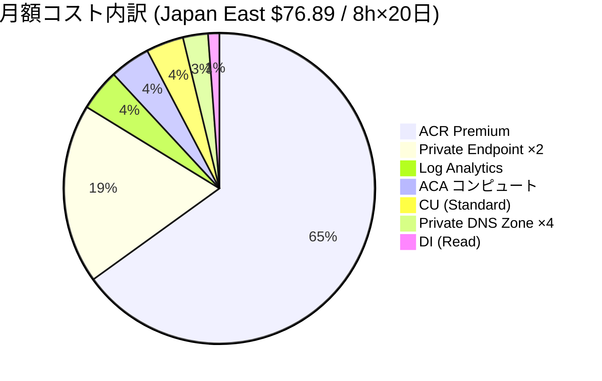

# 月額コスト見積もり

> **前提**: 本見積もりは Bicep で定義されたリソース構成をベースに、[Azure Retail Prices API](https://learn.microsoft.com/rest/api/cost-management/retail-prices/azure-retail-prices) および公式価格ページ (2025 年 5 月時点、Japan East リージョン、Pay-As-You-Go) から取得した単価で算出した概算です。実際の請求額は利用量・契約形態・為替レートにより変動します。正確な見積もりは [Azure Pricing Calculator](https://azure.microsoft.com/pricing/calculator/) を使用してください。

## 前提条件

| 項目 | 値 |
|---|---|
| リージョン | Japan East (`japaneast`) |
| 料金プラン | Pay-As-You-Go |
| 稼働時間 | 日中 8 時間 × 平日 20 日 = 160 時間/月 |
| ACA レプリカ数 | API: 0–1 (自動スケール) / UI: 0–1 (自動スケール) |
| ACA リソース | 既定 (0.25 vCPU / 0.5 GiB per container) |
| ログ取り込み量 | 1 GB/月 (PoC 想定) |
| AI サービス利用量 | 1 日 10 回 × 平均 3 ページ/回 = 月間 600 ページ (後述) |
| 通貨 | USD |

## 各サービスの課金モデル

本デモで使用する各 Azure サービスの**課金単位・課金のされ方・単価**を整理します。

### Azure Container Registry (ACR)

| 項目 | 内容 |
|---|---|
| **課金単位** | **日額固定** + ストレージ超過分 |
| **課金のされ方** | SKU (Basic / Standard / Premium) に応じた日額固定料金。本デモは **Premium** (Private Endpoint 必須のため) を使用。Premium には 500 GiB のストレージが含まれ、超過分は $0.003/GiB/日で加算。Geo レプリケーション追加時は $1.667/日/リージョン |
| **Japan East 単価** | Premium: **$1.667/日** ($50.01/月) |
| **無料枠** | なし |
| **公式価格ページ** | [Azure Container Registry の価格](https://azure.microsoft.com/pricing/details/container-registry/) |
| **課金ドキュメント** | [ACR のサービス レベル](https://learn.microsoft.com/azure/container-registry/container-registry-skus) |

### Azure Container Apps (ACA) — Consumption プラン

| 項目 | 内容 |
|---|---|
| **課金単位** | **vCPU 秒** + **GiB 秒** + **リクエスト数** |
| **課金のされ方** | レプリカがアクティブな秒数に対して vCPU とメモリの使用量を掛け合わせて課金。リクエスト課金はコンテナへの HTTP リクエスト数で加算。`minReplicas: 0` ならアイドル時の課金はゼロ、`minReplicas: 1` なら常時課金。スケールアウトで複数レプリカが起動するとレプリカ数分の費用が発生 |
| **Japan East 単価** | vCPU: **$0.000024/vCPU 秒**、メモリ: **$0.000003/GiB 秒**、リクエスト: **$0.40/100 万リクエスト** |
| **無料枠** | サブスクリプションあたり月間 **180,000 vCPU 秒** + **360,000 GiB 秒** + **200 万リクエスト** |
| **公式価格ページ** | [Azure Container Apps の価格](https://azure.microsoft.com/pricing/details/container-apps/) |
| **課金ドキュメント** | [Container Apps の課金](https://learn.microsoft.com/azure/container-apps/billing) |

### Azure Private Link (Private Endpoint)

| 項目 | 内容 |
|---|---|
| **課金単位** | **時間** + **データ処理量** |
| **課金のされ方** | Private Endpoint が存在する時間に対して時間課金。加えて Private Endpoint 経由のインバウンド/アウトバウンドデータ処理に対して GB 単位の従量課金 ($0.01/GB) が発生。本デモでは ACR 用と Foundry 用の 2 エンドポイントを使用 |
| **Japan East 単価** | **$0.01/時間** (≒ $7.20/月/エンドポイント)、データ処理: **$0.01/GB** |
| **無料枠** | なし |
| **公式価格ページ** | [Azure Private Link の価格](https://azure.microsoft.com/pricing/details/private-link/) |
| **課金ドキュメント** | [Private Link の価格の概要](https://learn.microsoft.com/azure/private-link/private-link-overview#pricing) |

### Azure Private DNS Zone

| 項目 | 内容 |
|---|---|
| **課金単位** | **ゾーン数/月** + **DNS クエリ数** |
| **課金のされ方** | ホストされるゾーン数に応じた月額固定料金 + DNS クエリ数に応じた従量課金。本デモは 4 ゾーン (`azurecr.io`, `cognitiveservices.azure.com`, `openai.azure.com`, `services.ai.azure.com`) を使用。VNet 内の DNS 解決がクエリとしてカウントされるが、PoC レベルではクエリ課金はほぼ無視できる |
| **Japan East 単価** | **$0.50/ゾーン/月**、クエリ: **$0.40/100 万クエリ** |
| **無料枠** | なし |
| **公式価格ページ** | [Azure DNS の価格](https://azure.microsoft.com/pricing/details/dns/) |
| **課金ドキュメント** | [Azure DNS の FAQ (課金)](https://learn.microsoft.com/azure/dns/dns-faq#how-much-does-azure-dns-cost-) |

### Azure Virtual Network (VNet)

| 項目 | 内容 |
|---|---|
| **課金単位** | **VNet 自体は無料** (データ転送は別途) |
| **課金のされ方** | VNet の作成・保持自体に費用はかからない。VNet ピアリング (インバウンド/アウトバウンド各 $0.01/GB)、VPN Gateway、NAT Gateway 等を追加した場合のみ追加費用が発生。本デモではピアリングや Gateway は使用しないため **$0** |
| **公式価格ページ** | [Azure Virtual Network の価格](https://azure.microsoft.com/pricing/details/virtual-network/) |

### Azure Monitor — Log Analytics ワークスペース

| 項目 | 内容 |
|---|---|
| **課金単位** | **データ取り込み (GB)** + **データ保持 (日数)** + **クエリ (スキャン量)** |
| **課金のされ方** | Log Analytics に取り込まれたデータ量 (GB) に対する従量課金が主要コスト。基本ログ (Basic Logs) と分析ログ (Analytics Logs) でレートが異なる。保持は最初 31 日間が取り込み料金に含まれ、それ以降は $0.12/GB/月。クエリはスキャンされたデータ量に応じて課金されるが、分析ログの標準クエリは取り込み料金に含まれる |
| **Japan East 単価** | 取り込み (Analytics Logs): **$3.34/GB**、保持 (31 日超): **$0.12/GB/月**、基本ログ取り込み: **$0.88/GB** |
| **無料枠** | **5 GB/月** (billing account 単位の取り込み無料枠) |
| **公式価格ページ** | [Azure Monitor の価格](https://azure.microsoft.com/pricing/details/monitor/) |
| **課金ドキュメント** | [Azure Monitor のコストと使用量](https://learn.microsoft.com/azure/azure-monitor/cost-usage) |

> **補足**: Japan East の取り込み単価 ($3.34/GB) は他リージョン (例: West US $2.30/GB) より高いため、コスト意識が高い場合はリージョン選択も検討材料です。

### Azure AI Foundry (AI Services アカウント) — Document Intelligence

| 項目 | 内容 |
|---|---|
| **課金単位** | **ページ数** |
| **課金のされ方** | API コールで処理された**ページ数**に対する従量課金。1 ページ = ドキュメント内の 1 ページ (PDF の場合) または 1 画像。モデルによってティア (Read / Prebuilt / Custom / Add-on) が異なり、ティアごとに単価が違う。S0 プランの基本料は無料、Free (F0) プランは月 500 ページまで無料だが PoC でも上限が低い |
| **Japan East 単価** | Read (`prebuilt-read`): **$1.50/1,000 ページ**、Prebuilt (`prebuilt-layout` 等): **$10.00/1,000 ページ**、Custom: **$10.00/1,000 ページ** |
| **無料枠** | F0 プランのみ月 500 ページ (本デモは S0 のため適用外) |
| **公式価格ページ** | [Azure AI Document Intelligence の価格](https://azure.microsoft.com/pricing/details/ai-document-intelligence/) |
| **課金ドキュメント** | [Document Intelligence の価格モデル](https://learn.microsoft.com/azure/ai-services/document-intelligence/concept/service-limits?view=doc-intel-4.0.0) |

### Azure AI Foundry (AI Services アカウント) — Content Understanding

| 項目 | 内容 |
|---|---|
| **課金単位** | **ページ数** (Content Extraction) + **ページ数** (Contextualization、オプション) |
| **課金のされ方** | Content Extraction (コンテンツ抽出) は処理ページ数による従量課金。Basic と Standard の 2 ティアがあり精度・機能が異なる。Field Extraction (フィールド抽出) を使用する場合は、追加で Contextualization 費用 + 内部的に呼び出される Azure OpenAI のトークン課金が発生。Content Extraction のみの場合は OpenAI 課金は不要 |
| **Japan East 単価** | Content Extraction Basic: **$1.00/1,000 ページ**、Content Extraction Standard: **$5.00/1,000 ページ**、Contextualization (Field Extraction 時): **+$1.00/1,000 ページ** |
| **無料枠** | なし (S0 プランの基本料は無料) |
| **公式価格ページ** | [Azure Content Understanding の価格](https://azure.microsoft.com/pricing/details/content-understanding/) |
| **課金ドキュメント** | [Content Understanding の概要](https://learn.microsoft.com/azure/ai-services/content-understanding/overview) |

### User Assigned Managed Identity

| 項目 | 内容 |
|---|---|
| **課金単位** | **無料** |
| **課金のされ方** | マネージド ID の作成・保持・使用に費用は発生しない。Azure RBAC によるトークン発行も無料 |
| **公式ドキュメント** | [マネージド ID の概要](https://learn.microsoft.com/azure/active-directory/managed-identities-azure-resources/overview) |

---

## リソース別コスト一覧

### インフラ固定費

| # | リソース | Bicep モジュール | SKU / プラン | 単価 | 数量 | 月額 (USD) |
|---|---|---|---|---|---|---|
| 1 | **ACR (Premium)** | `acr.bicep` | Premium | $1.667/日 | 30 日 | **$50.01** |
| 2 | **Private Endpoint (ACR)** | `acr.bicep` | - | $0.01/時 | 720 時間 | **$7.20** |
| 3 | **Private Endpoint (Foundry)** | `foundry.bicep` | - | $0.01/時 | 720 時間 | **$7.20** |
| 4 | **Private DNS Zone** × 4 | `privateDns.bicep` | - | $0.50/ゾーン/月 | 4 ゾーン | **$2.00** |
| 5 | **VNet** | `network.bicep` | - | 無料 | 1 | **$0.00** |
| 6 | **User Assigned MI** | `identity.bicep` | - | 無料 | 1 | **$0.00** |
| 7 | **Log Analytics** | `monitoring.bicep` | PerGB2018 | $3.34/GB (取り込み) | 1 GB | **$3.34** |
| 8 | **Foundry (AIServices) アカウント** | `foundry.bicep` | S0 | 無料 (基本料) | 1 | **$0.00** |
| | | | | | **小計** | **$69.75** |

> **注**: Log Analytics は最初の 5 GB/月 (billing account 単位) が無料です。PoC で 1 GB 程度の場合は無料枠内に収まる可能性がありますが、上記は有料レートで算出しています。Japan East の取り込み単価 ($3.34/GB) は West US ($2.30/GB) と比べて約 45% 高い点に留意してください。

### ACA コンピュート (Consumption プラン)

`minReplicas: 0` / `maxReplicas: 1` とし、日中 8 時間 (平日 20 日) のみリクエストがある前提で試算します。利用時間外はレプリカがゼロにスケールインし、コンピュート課金は発生しません。

- **アクティブ秒数**: 8 時間 × 3,600 秒 × 20 日 = **576,000 秒/月**

| コンポーネント | 計算 | 月額 (USD) |
|---|---|---|
| **API vCPU** | 0.25 vCPU × 576,000 秒/月 × $0.000024/秒 = $3.46 | |
| **API メモリ** | 0.5 GiB × 576,000 秒/月 × $0.000003/秒 = $0.86 | |
| **UI vCPU** | 0.25 vCPU × 576,000 秒/月 × $0.000024/秒 = $3.46 | |
| **UI メモリ** | 0.5 GiB × 576,000 秒/月 × $0.000003/秒 = $0.86 | |
| **無料枠控除 (vCPU)** | -180,000 vCPU 秒 × $0.000024 = -$4.32 | |
| **無料枠控除 (メモリ)** | -360,000 GiB 秒 × $0.000003 = -$1.08 | |
| | **小計** | **$3.24** |

> **注**: 無料枠 (月間 180,000 vCPU 秒 + 360,000 GiB 秒 + 200 万リクエスト) はサブスクリプション単位で 1 回のみ適用されます。他の ACA アプリが同一サブスクリプションにある場合は控除額が減ります。

#### 参考: 稼働パターン別コンピュート比較

| パターン | 稼働時間 | minReplicas | ACA 月額 (USD) | 基盤月額 (USD) |
|---|---|---|---|---|
| **日中 8h × 平日 20 日** ※本見積もり | 160 h | 0 | **$3.24** | **$72.99** |
| 24/7 常時稼働 | 720 h (24h × 30日) | 1 | $33.48 | $103.23 |
| 日中 8h × 毎日 30 日 | 240 h | 0 | $5.64 | $75.39 |

> `minReplicas: 0` では初回リクエスト時にコールドスタート (数秒〜十数秒) が発生します。レスポンス要件が厳しい場合は `minReplicas: 1` にして常時稼働を選択してください。

### 合計 (インフラ + コンピュート)

| 区分 | 月額 (USD) |
|---|---|
| インフラ固定費 | $69.75 |
| ACA コンピュート (8h × 20日) | $3.24 |
| **小計 (基盤)** | **$72.99** |

## AI サービス従量課金

Foundry (AIServices) の S0 プランは基本料が無料ですが、API 呼び出しはページ単位の従量課金です。**Document Intelligence と Content Understanding はそれぞれ独立した価格体系を持つ**ため、別々に試算します。

### 単価比較

| サービス | モデル / ティア | 単価 (S0 Pay-As-You-Go) | 価格ページ |
|---|---|---|---|
| **Document Intelligence** | `prebuilt-read` (Read) | **$1.50**/1,000 ページ | [価格](https://azure.microsoft.com/pricing/details/ai-document-intelligence/) |
| Document Intelligence | `prebuilt-layout` (Prebuilt) | $10.00/1,000 ページ | 同上 |
| **Content Understanding** | Content Extraction: Standard | **$5.00**/1,000 ページ | [価格](https://azure.microsoft.com/pricing/details/content-understanding/) |
| Content Understanding | Content Extraction: Basic | $1.00/1,000 ページ | 同上 |
| Content Understanding | Contextualization (フィールド抽出時) | +$1.00/1,000 ページ | 同上 |

> **注**: 本デモの既定構成では DI 側は `prebuilt-read` (Read ティア)、CU 側は Content Extraction: Standard を使用します。CU は Field Extraction (フィールド抽出) を併用する場合、別途 Contextualization 費用 + Azure OpenAI モデル利用料が加算されます。

### 使用量の想定

本デモは PoC / 検証用途であり、以下のような利用パターンを想定します。

| 項目 | 値 |
|---|---|
| 利用頻度 | 平日のみ (月 20 営業日) |
| 1 日あたりの OCR 実行回数 | 10 回 |
| 1 回あたりの平均ページ数 | 3 ページ (1〜5 ページの PDF / 画像) |
| 月間処理ページ数 | 20 日 × 10 回 × 3 ページ = **600 ページ** |

本デモは同一ファイルを DI / CU 双方で処理するため、各サービスとも 600 ページの課金が発生します。

### Document Intelligence の試算

| モデル | 計算 | 月額 (USD) |
|---|---|---|
| `prebuilt-read` (Read) | 600 ページ × $1.50/1,000 | **$0.90** |
| `prebuilt-layout` (Prebuilt) | 600 ページ × $10.00/1,000 | **$6.00** |

### Content Understanding の試算

| ティア | 計算 | 月額 (USD) |
|---|---|---|
| Content Extraction: Standard | 600 ページ × $5.00/1,000 | **$3.00** |
| + Field Extraction 併用時 | +600 ページ × $1.00/1,000 (Contextualization) + OpenAI トークン費用 | **+$0.60 + α** |

> CU の Field Extraction では Azure OpenAI のモデル (gpt-4.1 等) が内部的に呼び出され、トークン単位の別途課金が発生します。本デモの `prebuilt-read` では Field Extraction は使用しないため、Content Extraction のみで計算します。

### サービス別コスト比較 (標準 PoC: 月 600 ページ)

| 構成 | DI 費用 | CU 費用 | AI 合計 | 基盤費用 | **月額総計** |
|---|---|---|---|---|---|
| **DI (Read) + CU (Standard)** ※本デモ既定 | $0.90 | $3.00 | $3.90 | $72.99 | **$76.89** |
| DI (Read) のみ | $0.90 | - | $0.90 | $72.99 | **$73.89** |
| CU (Standard) のみ | - | $3.00 | $3.00 | $72.99 | **$75.99** |
| DI (Layout) + CU (Standard) | $6.00 | $3.00 | $9.00 | $72.99 | **$81.99** |

### 利用量別シミュレーション (本デモ既定: DI Read + CU Standard)

想定が異なる場合の参考値です。

| シナリオ | 月間ページ数 | DI Read | CU Standard | AI 合計 | 月額総計 |
|---|---|---|---|---|---|
| 軽い検証 (週数回) | 100 | $0.15 | $0.50 | $0.65 | **$73.64** |
| **標準 PoC (上記想定)** | **600** | **$0.90** | **$3.00** | **$3.90** | **$76.89** |
| 集中検証 (毎日 30 回) | 1,800 | $2.70 | $9.00 | $11.70 | **$84.69** |
| チーム利用 (5 人 × 20 回) | 6,000 | $9.00 | $30.00 | $39.00 | **$111.99** |

## 総合計

| 区分 | 月額 (USD) |
|---|---|
| インフラ固定費 | $69.75 |
| ACA コンピュート (8h × 20日) | $3.24 |
| AI サービス: DI (Read) | $0.90 |
| AI サービス: CU (Standard) | $3.00 |
| **月額合計** | **$76.89** |

> 上記は標準 PoC シナリオ (日中 8h × 平日 20 日稼働、月 600 ページ処理、DI Read + CU Standard) の場合です。24/7 常時稼働 (`minReplicas: 1`) にした場合は ACA コンピュートが $33.48 となり、月額合計は **$107.13** に増加します。

## コストの内訳 (視覚化)



## コスト最適化のヒント

| 施策 | 効果 | 方法 |
|---|---|---|
| ACA `minReplicas: 0` に変更 | ACA コンピュート費を大幅削減 (アイドル時 $0) | `containerApps.bicep` の `scale.minReplicas` を `0` に変更。cold start が発生する |
| Log Analytics の retention 短縮 | 長期保持コスト削減 | `monitoring.bicep` の `retentionInDays` を最小 (7 日) に変更 |
| ACR の古いイメージ自動削除 | ストレージ超過料金の回避 | ACR retention policy を設定 |
| 使わない時間帯に環境削除 | 全リソース費をゼロに | `azd down --purge --force` → 必要時に `azd up` |
| Savings Plan (1 年 / 3 年) | ACA コンピュートが最大 17% 割引 | [Azure Savings Plan](https://azure.microsoft.com/pricing/offers/savings-plan-compute/) |

## 環境完全削除時の月額

```powershell
azd down --purge --force
```

を実行すると全リソースが削除され、月額 **$0** になります。PoC / デモとして必要な時のみ `azd up` で再作成する運用が最もコスト効率が高いです。

## 価格参照元

| サービス | 価格ページ URL |
|---|---|
| Azure Container Apps | <https://azure.microsoft.com/pricing/details/container-apps/> |
| Azure Container Registry | <https://azure.microsoft.com/pricing/details/container-registry/> |
| Azure Private Link | <https://azure.microsoft.com/pricing/details/private-link/> |
| Azure DNS | <https://azure.microsoft.com/pricing/details/dns/> |
| Azure Monitor (Log Analytics) | <https://azure.microsoft.com/pricing/details/monitor/> |
| Azure AI Document Intelligence | <https://azure.microsoft.com/pricing/details/ai-document-intelligence/> |
| Azure Content Understanding | <https://azure.microsoft.com/pricing/details/content-understanding/> |
