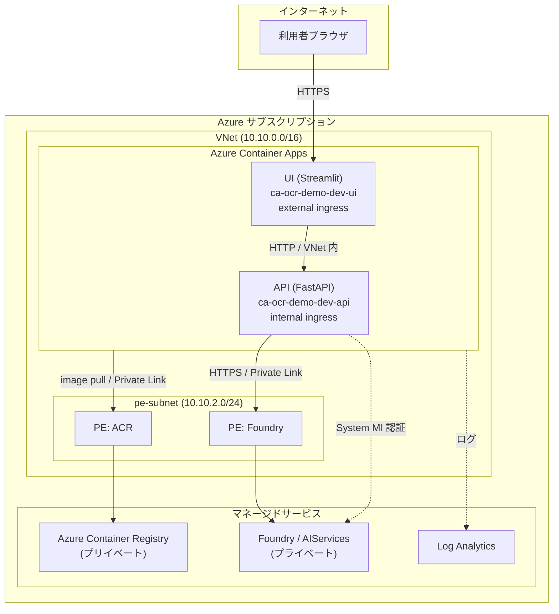

# 要件定義

## 概要

OCR-Demo は、**Microsoft Foundry (新版 AIServices)** が提供する 2 つの OCR 関連 REST API、**Document Intelligence (`prebuilt-read`)** と **Content Understanding (`prebuilt-read`)** の出力を**同一ファイルに対して並行実行**し、結果と所要時間を **UI 上で左右並べて比較**するデモアプリケーションである。

## システム構成図

## 機能要件

| ID | 機能名 | 内容 | 備考 |
|---|---|---|---|
| FR-001 | ファイルアップロード | UI でローカルの PDF / 画像（jpg, png, tiff）をアップロードできる | サイズ上限 20 MB (API 側で検証) |
| FR-002 | 並行 OCR 実行 | アップロードされたファイルを Document Intelligence と Content Understanding の双方で同時に解析する | バックエンドで `ThreadPoolExecutor` 並列実行 |
| FR-003 | 結果の左右比較表示 | 抽出テキスト / マークダウン / ページ語句単位の bbox を左右ペインで並べて表示する | UI: Streamlit columns |
| FR-004 | 所要時間の表示 | 各サービスの呼び出し所要時間 (ms) を表示する | API レスポンスの `elapsedMs` |
| FR-005 | 1 ページ目の単語ハイライト | ページ 1 の単語ごとに polygon を画像にオーバーレイ表示する | DI / CU の polygon を正規化 |
| FR-006 | 設定パラメータの上書き | analyzer ID / model ID / API version を環境変数で上書きできる | `azd env set` |

## 非機能要件

| 区分 | 要件 |
|---|---|
| 認証 | リソース間通信は Managed Identity + Entra ID（API キー禁止）。`disableLocalAuth: true` |
| ネットワーク | Foundry / ACR は `publicNetworkAccess: Disabled` + Private Endpoint。UI のみ ingress を external 公開 |
| RBAC | 最小権限：`Cognitive Services User`（アカウント）/ `Azure AI User`（プロジェクト）/ `AcrPull`（ACR） |
| 観測性 | ACA 環境ログを Log Analytics へ Diagnostic Settings 経由（共有キー不要） |
| デプロイ | azd 1 コマンド (`azd up`) で provision + deploy 完結 |
| ビルド | コンテナイメージは ACR remoteBuild。デプロイ時のみ ACR public を一時開放（hook 自動化） |
| IaC | Bicep `targetScope = 'subscription'` + モジュール分割（`infra/modules/`） |

## 制約事項

- 対応リージョンは Foundry / Document Intelligence / Content Understanding が同時提供されるリージョンに限定（既定: `westus`）
- Container Apps Environment は VNet 統合のため一度作成すると `internal` 設定変更不可
- ACR Premium SKU 必須（Private Endpoint 利用条件）
- 新版 Foundry プロジェクトのため API バージョンは `2025-04-01-preview`（プロジェクト管理機能の GA を待って差し替え予定）
